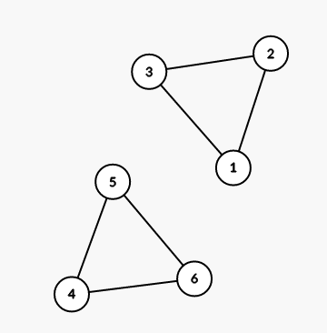
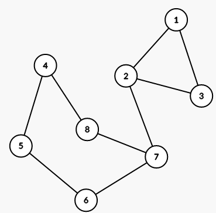

<h1 style='text-align: center;'> C. Bipartite Segments</h1>

<h5 style='text-align: center;'>time limit per test: 2 seconds</h5>
<h5 style='text-align: center;'>memory limit per test: 256 megabytes</h5>

You are given an undirected graph with *n* vertices. There are no edge-simple cycles with the even length in it. In other words, there are no cycles of even length that pass each edge at most once. Let's enumerate vertices from 1 to *n*. 

You have to answer *q* queries. Each query is described by a segment of vertices [*l*; *r*], and you have to count the number of its subsegments [*x*; *y*] (*l* ≤ *x* ≤ *y* ≤ *r*), such that if we delete all vertices except the segment of vertices [*x*; *y*] (including *x* and *y*) and edges between them, the resulting graph is bipartite.

## Input

The first line contains two integers *n* and *m* (1 ≤ *n* ≤ 3·105, 1 ≤ *m* ≤ 3·105) — the number of vertices and the number of edges in the graph.

The next *m* lines describe edges in the graph. The *i*-th of these lines contains two integers *a**i* and *b**i* (1 ≤ *a**i*, *b**i* ≤ *n*; *a**i* ≠ *b**i*), denoting an edge between vertices *a**i* and *b**i*. It is guaranteed that this graph does not contain edge-simple cycles of even length.

The next line contains a single integer *q* (1 ≤ *q* ≤ 3·105) — the number of queries.

The next *q* lines contain queries. The *i*-th of these lines contains two integers *l**i* and *r**i* (1 ≤ *l**i* ≤ *r**i* ≤ *n*) — the query parameters.

## Output

Print *q* numbers, each in new line: the *i*-th of them should be the number of subsegments [*x*; *y*] (*l**i* ≤ *x* ≤ *y* ≤ *r**i*), such that the graph that only includes vertices from segment [*x*; *y*] and edges between them is bipartite.

## Examples

## Input


```
6 6  
1 2  
2 3  
3 1  
4 5  
5 6  
6 4  
3  
1 3  
4 6  
1 6  

```
## Output


```
5  
5  
14  

```
## Input


```
8 9  
1 2  
2 3  
3 1  
4 5  
5 6  
6 7  
7 8  
8 4  
7 2  
3  
1 8  
1 4  
3 8  

```
## Output


```
27  
8  
19  

```
## Note

The first example is shown on the picture below:



For the first query, all subsegments of [1; 3], except this segment itself, are suitable.

For the first query, all subsegments of [4; 6], except this segment itself, are suitable.

For the third query, all subsegments of [1; 6] are suitable, except [1; 3], [1; 4], [1; 5], [1; 6], [2; 6], [3; 6], [4; 6].

The second example is shown on the picture below:




#### tags 

#2300 #binary_search #data_structures #dfs_and_similar #dsu #graphs #two_pointers 