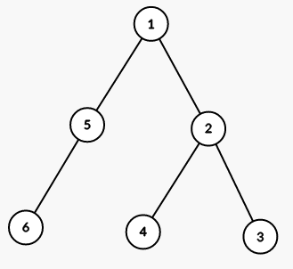
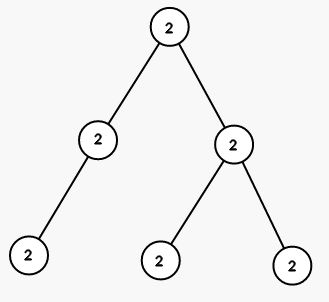
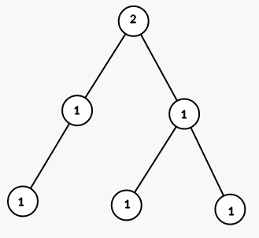
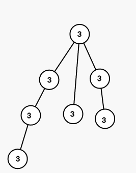
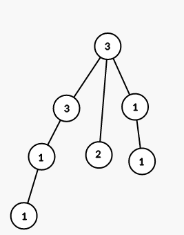

<h1 style='text-align: center;'> B. Coloring a Tree</h1>

<h5 style='text-align: center;'>time limit per test: 1 second</h5>
<h5 style='text-align: center;'>memory limit per test: 256 megabytes</h5>

You are given a rooted tree with *n* vertices. The vertices are numbered from 1 to *n*, the root is the vertex number 1.

Each vertex has a color, let's denote the color of vertex *v* by *c**v*. Initially *c**v* = 0.

You have to color the tree into the given colors using the smallest possible number of steps. On each step you can choose a vertex *v* and a color *x*, and then color all vectices in the subtree of *v* (including *v* itself) in color *x*. In other words, for every vertex *u*, such that the path from root to *u* passes through *v*, set *c**u* = *x*.

It is guaranteed that you have to color each vertex in a color different from 0.

You can learn what a rooted tree is using the link: <https://en.wikipedia.org/wiki/Tree_(graph_theory)>.

## Input

The first line contains a single integer *n* (2 ≤ *n* ≤ 104) — the number of vertices in the tree.

The second line contains *n* - 1 integers *p*2, *p*3, ..., *p**n* (1 ≤ *p**i* < *i*), where *p**i* means that there is an edge between vertices *i* and *p**i*.

The third line contains *n* integers *c*1, *c*2, ..., *c**n* (1 ≤ *c**i* ≤ *n*), where *c**i* is the color you should color the *i*-th vertex into.

It is guaranteed that the given graph is a tree. 

## Output

Print a single integer — the minimum number of steps you have to perform to color the tree into given colors.

## Examples

## Input


```
6  
1 2 2 1 5  
2 1 1 1 1 1  

```
## Output


```
3  

```
## Input


```
7  
1 1 2 3 1 4  
3 3 1 1 1 2 3  

```
## Output


```
5  

```
## Note

The tree from the first sample is shown on the picture (numbers are vetices' indices):



On first step we color all vertices in the subtree of vertex 1 into color 2 (numbers are colors):



On seond step we color all vertices in the subtree of vertex 5 into color 1:


On third step we color all vertices in the subtree of vertex 2 into color 1:



The tree from the second sample is shown on the picture (numbers are vetices' indices):


On first step we color all vertices in the subtree of vertex 1 into color 3 (numbers are colors):



On second step we color all vertices in the subtree of vertex 3 into color 1:


On third step we color all vertices in the subtree of vertex 6 into color 2:


On fourth step we color all vertices in the subtree of vertex 4 into color 1:



On fith step we color all vertices in the subtree of vertex 7 into color 3:


#### tags 

#1200 #dfs_and_similar #dsu #greedy 