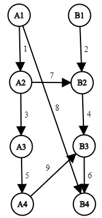

<h1 style='text-align: center;'> G. Yet Another Maxflow Problem</h1>

<h5 style='text-align: center;'>time limit per test: 4 seconds</h5>
<h5 style='text-align: center;'>memory limit per test: 256 megabytes</h5>

In this problem you will have to deal with a very special network.

The network consists of two parts: part *A* and part *B*. Each part consists of *n* vertices; *i*-th vertex of part *A* is denoted as *A**i*, and *i*-th vertex of part *B* is denoted as *B**i*.

For each index *i* (1 ≤ *i* < *n*) there is a directed edge from vertex *A**i* to vertex *A**i* + 1, and from *B**i* to *B**i* + 1, respectively. Capacities of these edges are given in the input. Also there might be several directed edges going from part *A* to part *B* (but never from *B* to *A*).

You have to calculate the [maximum flow value](https://en.wikipedia.org/wiki/Maximum_flow_problem) from *A*1 to *B**n* in this network. Capacities of edges connecting *A**i* to *A**i* + 1 might sometimes change, and you also have to maintain the maximum flow value after these changes. Apart from that, the network is fixed (there are no changes in part *B*, no changes of edges going from *A* to *B*, and no edge insertions or deletions).

Take a look at the example and the notes to understand the structure of the network better.

## Input

The first line contains three integer numbers *n*, *m* and *q* (2 ≤ *n*, *m* ≤ 2·105, 0 ≤ *q* ≤ 2·105) — the number of vertices in each part, the number of edges going from *A* to *B* and the number of changes, respectively.

Then *n* - 1 lines follow, *i*-th line contains two integers *x**i* and *y**i* denoting that the edge from *A**i* to *A**i* + 1 has capacity *x**i* and the edge from *B**i* to *B**i* + 1 has capacity *y**i* (1 ≤ *x**i*, *y**i* ≤ 109).

Then *m* lines follow, describing the edges from *A* to *B*. Each line contains three integers *x*, *y* and *z* denoting an edge from *A**x* to *B**y* with capacity *z* (1 ≤ *x*, *y* ≤ *n*, 1 ≤ *z* ≤ 109). There might be multiple edges from *A**x* to *B**y*.

And then *q* lines follow, describing a sequence of changes to the network. *i*-th line contains two integers *v**i* and *w**i*, denoting that the capacity of the edge from *A**v**i* to *A**v**i* + 1 is set to *w**i* (1 ≤ *v**i* < *n*, 1 ≤ *w**i* ≤ 109).

## Output

Firstly, print the maximum flow value in the original network. Then print *q* integers, *i*-th of them must be equal to the maximum flow value after *i*-th change.

## Example

## Input


```
4 3 2  
1 2  
3 4  
5 6  
2 2 7  
1 4 8  
4 3 9  
1 100  
2 100  

```
## Output


```
9  
14  
14  

```
## Note

This is the original network in the example:

  

#### tags 

#2700 #data_structures #flows #graphs 