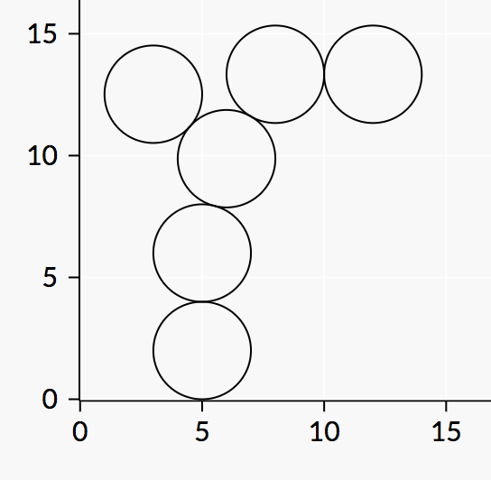

<h1 style='text-align: center;'> C. New Year and Curling</h1>

<h5 style='text-align: center;'>time limit per test: 2 seconds</h5>
<h5 style='text-align: center;'>memory limit per test: 256 megabytes</h5>

Carol is currently curling.

She has *n* disks each with radius *r* on the 2D plane. 

Initially she has all these disks above the line *y* = 10100.

She then will slide the disks towards the line *y* = 0 one by one in order from 1 to *n*. 

When she slides the *i*-th disk, she will place its center at the point (*x**i*, 10100). She will then push it so the disk’s *y* coordinate continuously decreases, and *x* coordinate stays constant. The disk stops once it touches the line *y* = 0 or it touches any previous disk. ## Note

 that once a disk stops moving, it will not move again, even if hit by another disk. 

Compute the *y*-coordinates of centers of all the disks after all disks have been pushed.

## Input

The first line will contain two integers *n* and *r* (1 ≤ *n*, *r* ≤ 1 000), the number of disks, and the radius of the disks, respectively.

The next line will contain *n* integers *x*1, *x*2, ..., *x**n* (1 ≤ *x**i* ≤ 1 000) — the *x*-coordinates of the disks.

## Output

Print a single line with *n* numbers. The *i*-th number denotes the *y*-coordinate of the center of the *i*-th disk. The output will be accepted if it has absolute or relative error at most 10- 6.

Namely, let's assume that your answer for a particular value of a coordinate is *a* and the answer of the jury is *b*. The checker program will consider your answer correct if  for all coordinates.

## Example

## Input


```
6 2  
5 5 6 8 3 12  

```
## Output


```
2 6.0 9.87298334621 13.3370849613 12.5187346573 13.3370849613  

```
## Note

The final positions of the disks will look as follows:

  In particular, note the position of the last disk. 


#### tags 

#1500 #brute_force #geometry #implementation #math 