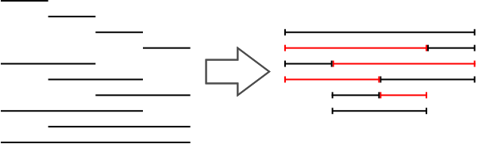

<h1 style='text-align: center;'> B. Segments</h1>

<h5 style='text-align: center;'>time limit per test: 2 seconds</h5>
<h5 style='text-align: center;'>memory limit per test: 256 megabytes</h5>

You are given an integer *N*. Consider all possible segments on the coordinate axis with endpoints at integer points with coordinates between 0 and *N*, inclusive; there will be  of them.

You want to draw these segments in several layers so that in each layer the segments don't overlap (they might touch at the endpoints though). You can not move the segments to a different location on the coordinate axis. 

Find the minimal number of layers you have to use for the given *N*.

## Input

The only input line contains a single integer *N* (1 ≤ *N* ≤ 100).

## Output

## Output

 a single integer - the minimal number of layers required to draw the segments for the given *N*.

## Examples

## Input


```
2  

```
## Output


```
2  

```
## Input


```
3  

```
## Output


```
4  

```
## Input


```
4  

```
## Output


```
6  

```
## Note

As an example, here are the segments and their optimal arrangement into layers for *N* = 4.

  

#### tags 

#1300 #constructive_algorithms #math 