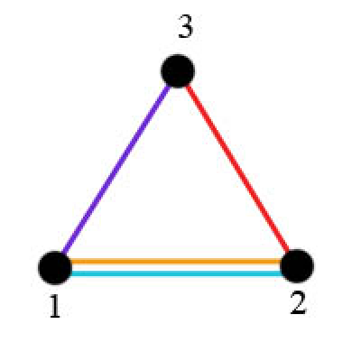
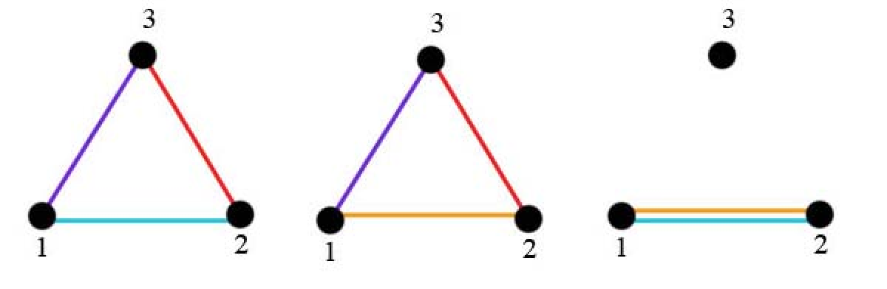

<h1 style='text-align: center;'> C. Ski Base</h1>

<h5 style='text-align: center;'>time limit per test: 2 seconds</h5>
<h5 style='text-align: center;'>memory limit per test: 256 megabytes</h5>

A ski base is planned to be built in Walrusland. Recently, however, the project is still in the constructing phase. A large land lot was chosen for the construction. It contains *n* ski junctions, numbered from 1 to *n*. Initially the junctions aren't connected in any way.

In the constructing process *m* bidirectional ski roads will be built. The roads are built one after another: first the road number 1 will be built, then the road number 2, and so on. The *i*-th road connects the junctions with numbers *a**i* and *b**i*.

Track is the route with the following properties: 

* The route is closed, that is, it begins and ends in one and the same junction.
* The route contains at least one road.
* The route doesn't go on one road more than once, however it can visit any junction any number of times.

Let's consider the ski base as a non-empty set of roads that can be divided into one or more tracks so that exactly one track went along each road of the chosen set. Besides, each track can consist only of roads from the chosen set. Ski base doesn't have to be connected.

Two ski bases are considered different if they consist of different road sets.

After building each new road the Walrusland government wants to know the number of variants of choosing a ski base based on some subset of the already built roads. The government asks you to help them solve the given problem.

## Input

The first line contains two integers *n* and *m* (2 ≤ *n* ≤ 105, 1 ≤ *m* ≤ 105). They represent the number of junctions and the number of roads correspondingly. Then on *m* lines follows the description of the roads in the order in which they were built. Each road is described by a pair of integers *a**i* and *b**i* (1 ≤ *a**i*, *b**i* ≤ *n*, *a**i* ≠ *b**i*) — the numbers of the connected junctions. There could be more than one road between a pair of junctions.

## Output

Print *m* lines: the *i*-th line should represent the number of ways to build a ski base after the end of construction of the road number *i*. The numbers should be printed modulo 1000000009 (109 + 9).

## Examples

## Input


```
3 4  
1 3  
2 3  
1 2  
1 2  

```
## Output


```
0  
0  
1  
3  

```
## Note

Let us have 3 junctions and 4 roads between the junctions have already been built (as after building all the roads in the sample): 1 and 3, 2 and 3, 2 roads between junctions 1 and 2. The land lot for the construction will look like this:

   The land lot for the construction will look in the following way:

   We can choose a subset of roads in three ways:

   In the first and the second ways you can choose one path, for example, 1 - 2 - 3 - 1. In the first case you can choose one path 1 - 2 - 1.


#### tags 

#2300 #combinatorics #dsu #graphs 