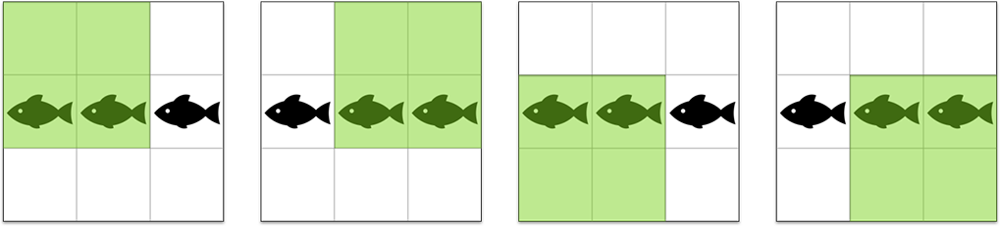

<h1 style='text-align: center;'> D. Fishes</h1>

<h5 style='text-align: center;'>time limit per test: 1 second</h5>
<h5 style='text-align: center;'>memory limit per test: 256 megabytes</h5>

While Grisha was celebrating New Year with Ded Moroz, Misha gifted Sasha a small rectangular pond of size *n* × *m*, divided into cells of size 1 × 1, inhabited by tiny evil fishes (no more than one fish per cell, otherwise they'll strife!).

The gift bundle also includes a square scoop of size *r* × *r*, designed for fishing. If the lower-left corner of the scoop-net is located at cell (*x*, *y*), all fishes inside the square (*x*, *y*)...(*x* + *r* - 1, *y* + *r* - 1) get caught. ## Note

 that the scoop-net should lie completely inside the pond when used.

Unfortunately, Sasha is not that skilled in fishing and hence throws the scoop randomly. In order to not frustrate Sasha, Misha decided to release *k* fishes into the empty pond in such a way that the expected value of the number of caught fishes is as high as possible. Help Misha! In other words, put *k* fishes in the pond into distinct cells in such a way that when the scoop-net is placed into a random position among (*n* - *r* + 1)·(*m* - *r* + 1) possible positions, the average number of caught fishes is as high as possible.

## Input

The only line contains four integers *n*, *m*, *r*, *k* (1 ≤ *n*, *m* ≤ 105, 1 ≤ *r* ≤ *min*(*n*, *m*), 1 ≤ *k* ≤ *min*(*n*·*m*, 105)).

## Output

Print a single number — the maximum possible expected number of caught fishes.

You answer is considered correct, is its absolute or relative error does not exceed 10- 9. Namely, let your answer be *a*, and the jury's answer be *b*. Your answer is considered correct, if .

## Examples

## Input


```
3 3 2 3  

```
## Output


```
2.0000000000  

```
## Input


```
12 17 9 40  

```
## Output


```
32.8333333333  

```
## Note

In the first example you can put the fishes in cells (2, 1), (2, 2), (2, 3). In this case, for any of four possible positions of the scoop-net (highlighted with light green), the number of fishes inside is equal to two, and so is the expected value.

  

#### tags 

#2100 #data_structures #graphs #greedy #probabilities #shortest_paths 