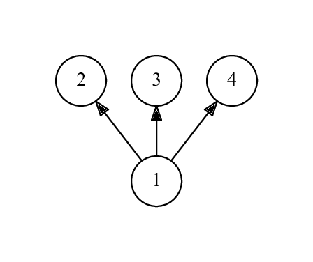
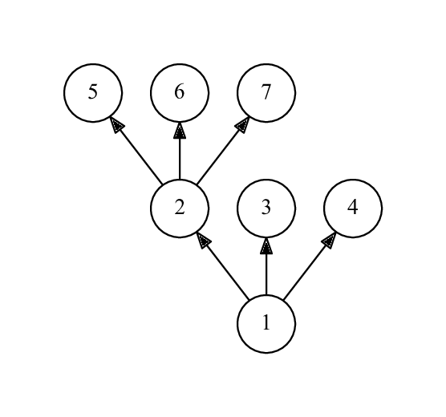
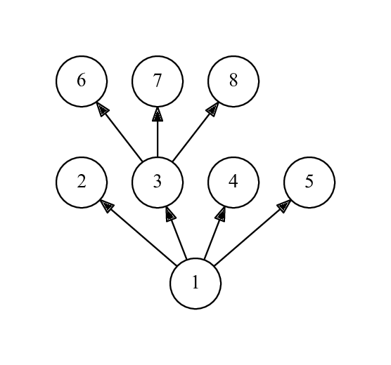

<h1 style='text-align: center;'> B. Christmas Spruce</h1>

<h5 style='text-align: center;'>time limit per test: 1 second</h5>
<h5 style='text-align: center;'>memory limit per test: 256 megabytes</h5>

Consider a rooted tree. A rooted tree has one special vertex called the root. All edges are directed from the root. Vertex *u* is called a child of vertex *v* and vertex *v* is called a parent of vertex *u* if there exists a directed edge from *v* to *u*. A vertex is called a leaf if it doesn't have children and has a parent.

Let's call a rooted tree a spruce if its every non-leaf vertex has at least 3 leaf children. You are given a rooted tree, check whether it's a spruce.

The definition of a rooted tree can be found [here](https://goo.gl/1dqvzz).

## Input

The first line contains one integer *n* — the number of vertices in the tree (3 ≤ *n* ≤ 1 000). Each of the next *n* - 1 lines contains one integer *p**i* (1 ≤ *i* ≤ *n* - 1) — the index of the parent of the *i* + 1-th vertex (1 ≤ *p**i* ≤ *i*).

Vertex 1 is the root. It's guaranteed that the root has at least 2 children.

## Output

Print "Yes" if the tree is a spruce and "No" otherwise.

## Examples

## Input


```
4  
1  
1  
1  

```
## Output


```
Yes  

```
## Input


```
7  
1  
1  
1  
2  
2  
2  

```
## Output


```
No  

```
## Input


```
8  
1  
1  
1  
1  
3  
3  
3  

```
## Output


```
Yes  

```
## Note

The first example:



The second example:



It is not a spruce, because the non-leaf vertex 1 has only 2 leaf children.

The third example:




#### tags 

#1200 #implementation #trees 