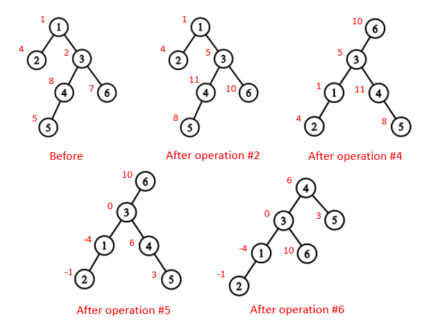

<h1 style='text-align: center;'> E. Jamie and Tree</h1>

<h5 style='text-align: center;'>time limit per test: 2.5 seconds</h5>
<h5 style='text-align: center;'>memory limit per test: 256 megabytes</h5>

To your surprise, Jamie is the final boss! Ehehehe.

Jamie has given you a tree with *n* vertices, numbered from 1 to *n*. Initially, the root of the tree is the vertex with number 1. Also, each vertex has a value on it.

Jamie also gives you three types of queries on the tree:

1 *v* — Change the tree's root to vertex with number *v*.

2 *u* *v* *x* — For each vertex in the subtree of smallest size that contains *u* and *v*, add *x* to its value.

3 *v* — Find sum of values of vertices in the subtree of vertex with number *v*.

A subtree of vertex *v* is a set of vertices such that *v* lies on shortest path from this vertex to root of the tree. Pay attention that subtree of a vertex can change after changing the tree's root.

Show your strength in programming to Jamie by performing the queries accurately!

## Input

The first line of input contains two space-separated integers *n* and *q* (1 ≤ *n* ≤ 105, 1 ≤ *q* ≤ 105) — the number of vertices in the tree and the number of queries to process respectively.

The second line contains *n* space-separated integers *a*1, *a*2, ..., *a**n* ( - 108 ≤ *a**i* ≤ 108) — initial values of the vertices.

Next *n* - 1 lines contains two space-separated integers *u**i*, *v**i* (1 ≤ *u**i*, *v**i* ≤ *n*) describing edge between vertices *u**i* and *v**i* in the tree.

The following *q* lines describe the queries.

Each query has one of following formats depending on its type:

1 *v* (1 ≤ *v* ≤ *n*) for queries of the first type.

2 *u* *v* *x* (1 ≤ *u*, *v* ≤ *n*,  - 108 ≤ *x* ≤ 108) for queries of the second type.

3 *v* (1 ≤ *v* ≤ *n*) for queries of the third type.

All numbers in queries' descriptions are integers.

The queries must be carried out in the given order. It is guaranteed that the tree is valid.

## Output

For each query of the third type, output the required answer. It is guaranteed that at least one query of the third type is given by Jamie.

## Examples

## Input


```
6 7  
1 4 2 8 5 7  
1 2  
3 1  
4 3  
4 5  
3 6  
3 1  
2 4 6 3  
3 4  
1 6  
2 2 4 -5  
1 4  
3 3  

```
## Output


```
27  
19  
5  

```
## Input


```
4 6  
4 3 5 6  
1 2  
2 3  
3 4  
3 1  
1 3  
2 2 4 3  
1 1  
2 2 4 -3  
3 1  

```
## Output


```
18  
21  

```
## Note

The following picture shows how the tree varies after the queries in the first sample. 

  

#### tags 

#2400 #data_structures #trees 