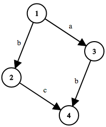
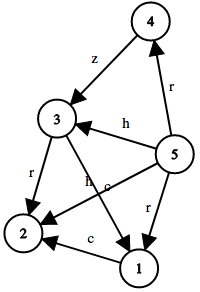

<h1 style='text-align: center;'> B. MADMAX</h1>

<h5 style='text-align: center;'>time limit per test: 1 second</h5>
<h5 style='text-align: center;'>memory limit per test: 256 megabytes</h5>

As we all know, Max is the best video game player among her friends. Her friends were so jealous of hers, that they created an actual game just to prove that she's not the best at games. The game is played on a directed acyclic graph (a DAG) with *n* vertices and *m* edges. There's a character written on each edge, a lowercase English letter.

  Max and Lucas are playing the game. Max goes first, then Lucas, then Max again and so on. Each player has a marble, initially located at some vertex. Each player in his/her turn should move his/her marble along some edge (a player can move the marble from vertex *v* to vertex *u* if there's an outgoing edge from *v* to *u*). If the player moves his/her marble from vertex *v* to vertex *u*, the "character" of that round is the character written on the edge from *v* to *u*. There's one additional rule; the ASCII code of character of round *i* should be greater than or equal to the ASCII code of character of round *i* - 1 (for *i* > 1). The rounds are numbered for both players together, i. e. Max goes in odd numbers, Lucas goes in even numbers. The player that can't make a move loses the game. The marbles may be at the same vertex at the same time.

Since the game could take a while and Lucas and Max have to focus on finding Dart, they don't have time to play. So they asked you, if they both play optimally, who wins the game?

You have to determine the winner of the game for all initial positions of the marbles.

## Input

The first line of input contains two integers *n* and *m* (2 ≤ *n* ≤ 100, ).

The next *m* lines contain the edges. Each line contains two integers *v*, *u* and a lowercase English letter *c*, meaning there's an edge from *v* to *u* written *c* on it (1 ≤ *v*, *u* ≤ *n*, *v* ≠ *u*). There's at most one edge between any pair of vertices. It is guaranteed that the graph is acyclic.

## Output

Print *n* lines, a string of length *n* in each one. The *j*-th character in *i*-th line should be 'A' if Max will win the game in case her marble is initially at vertex *i* and Lucas's marble is initially at vertex *j*, and 'B' otherwise.

## Examples

## Input


```
4 4  
1 2 b  
1 3 a  
2 4 c  
3 4 b  

```
## Output


```
BAAA  
ABAA  
BBBA  
BBBB  

```
## Input


```
5 8  
5 3 h  
1 2 c  
3 1 c  
3 2 r  
5 1 r  
4 3 z  
5 4 r  
5 2 h  

```
## Output


```
BABBB  
BBBBB  
AABBB  
AAABA  
AAAAB  

```
## Note

Here's the graph in the first sample test case:

  Here's the graph in the second sample test case:

  

#### tags 

#1700 #dfs_and_similar #dp #games #graphs 