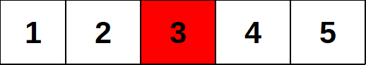
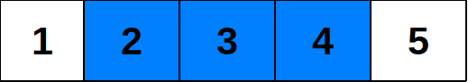

<h1 style='text-align: center;'> A. Water The Garden</h1>

<h5 style='text-align: center;'>time limit per test: 1 second</h5>
<h5 style='text-align: center;'>memory limit per test: 256 megabytes</h5>

It is winter now, and Max decided it's about time he watered the garden.

The garden can be represented as *n* consecutive garden beds, numbered from 1 to *n*. *k* beds contain water taps (*i*-th tap is located in the bed *x**i*), which, if turned on, start delivering water to neighbouring beds. If the tap on the bed *x**i* is turned on, then after one second has passed, the bed *x**i* will be watered; after two seconds have passed, the beds from the segment [*x**i* - 1, *x**i* + 1] will be watered (if they exist); after *j* seconds have passed (*j* is an integer number), the beds from the segment [*x**i* - (*j* - 1), *x**i* + (*j* - 1)] will be watered (if they exist). Nothing changes during the seconds, so, for example, we can't say that the segment [*x**i* - 2.5, *x**i* + 2.5] will be watered after 2.5 seconds have passed; only the segment [*x**i* - 2, *x**i* + 2] will be watered at that moment.

  The garden from test 1. White colour denotes a garden bed without a tap, red colour — a garden bed with a tap.   The garden from test 1 after 2 seconds have passed after turning on the tap. White colour denotes an unwatered garden bed, blue colour — a watered bed. Max wants to turn on all the water taps at the same moment, and now he wonders, what is the minimum number of seconds that have to pass after he turns on some taps until the whole garden is watered. Help him to find the answer!

## Input

The first line contains one integer *t* — the number of test cases to solve (1 ≤ *t* ≤ 200).

Then *t* test cases follow. The first line of each test case contains two integers *n* and *k* (1 ≤ *n* ≤ 200, 1 ≤ *k* ≤ *n*) — the number of garden beds and water taps, respectively.

Next line contains *k* integers *x**i* (1 ≤ *x**i* ≤ *n*) — the location of *i*-th water tap. It is guaranteed that for each  condition *x**i* - 1 < *x**i* holds.

It is guaranteed that the sum of *n* over all test cases doesn't exceed 200.

## Note

 that in hacks you have to set *t* = 1.

## Output

For each test case print one integer — the minimum number of seconds that have to pass after Max turns on some of the water taps, until the whole garden is watered.

## Example

## Input


```
3  
5 1  
3  
3 3  
1 2 3  
4 1  
1  

```
## Output


```
3  
1  
4  

```
## Note

The first example consists of 3 tests:

1. There are 5 garden beds, and a water tap in the bed 3. If we turn it on, then after 1 second passes, only bed 3 will be watered; after 2 seconds pass, beds [1, 3] will be watered, and after 3 seconds pass, everything will be watered.
2. There are 3 garden beds, and there is a water tap in each one. If we turn all of them on, then everything will be watered after 1 second passes.
3. There are 4 garden beds, and only one tap in the bed 1. It will take 4 seconds to water, for example, bed 4.


#### tags 

#1000 #implementation 