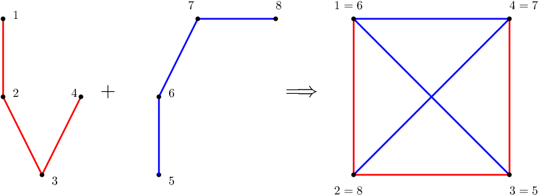

<h1 style='text-align: center;'> F. Public Service</h1>

<h5 style='text-align: center;'>time limit per test: 4 seconds</h5>
<h5 style='text-align: center;'>memory limit per test: 256 megabytes</h5>

There are *N* cities in Bob's country connected by roads. Some pairs of cities are connected by public transport. There are two competing transport companies — Boblines operating buses and Bobrail running trains. When traveling from *A* to *B*, a passenger always first selects the mode of transport (either bus or train), and then embarks on a journey. For every pair of cities, there are exactly two ways of how to travel between them without visiting any city more than once — one using only bus routes, and the second using only train routes. Furthermore, there is no pair of cities that is directly connected by both a bus route and a train route.

You obtained the plans of each of the networks. Unfortunately, each of the companies uses different names for the same cities. More precisely, the bus company numbers the cities using integers from 1 to *N*, while the train company uses integers between *N* + 1 and 2*N*. Find one possible mapping between those two numbering schemes, such that no pair of cities is connected directly by both a bus route and a train route. ## Note

 that this mapping has to map different cities to different cities.

## Input

The first line contains an integer *N* (2 ≤ *N* ≤ 10000), the number of cities.

*N* - 1 lines follow, representing the network plan of Boblines. Each contains two integers *u* and *v* (1 ≤ *u*, *v* ≤ *N*), meaning that there is a bus route between cities *u* and *v*.

*N* - 1 lines follow, representing the network plan of Bobrail. Each contains two integers *u* and *v* (*N* + 1 ≤ *u*, *v* ≤ 2*N*), meaning that there is a train route between cities *u* and *v*.

## Output

If there is no solution, output a single line with the word "No".

If a solution exists, output two lines. On the first line, there should be the word "Yes". On the second line, there should be *N* integers *P*1, *P*2, ..., *P**N* (*N* + 1 ≤ *P**i* ≤ 2*N*) — the mapping between the two numbering schemes. More precisely, for *i* ≠ *j* it should be *P**i* ≠ *P**j*, and for every direct bus route (*i*, *j*), there is no direct train route between (*P**i*, *P**j*).

If there are multiple solutions, you may print any of them.

## Examples

## Input


```
4  
1 2  
2 3  
3 4  
5 6  
6 7  
7 8  

```
## Output


```
Yes  
6 8 5 7  

```
## Input


```
4  
1 2  
2 3  
3 4  
5 6  
5 7  
5 8  

```
## Output


```
No  

```
## Input


```
7  
1 2  
1 3  
1 4  
1 5  
5 6  
6 7  
8 9  
9 10  
10 11  
11 12  
12 13  
13 14  

```
## Output


```
Yes  
9 14 11 12 13 10 8  

```
## Note

The first sample (bus lines in red and rail lines in blue):




#### tags 

#3200 #constructive_algorithms #graphs #trees 