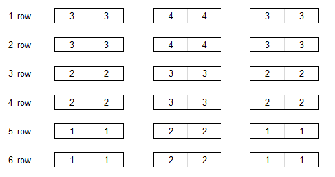

<h1 style='text-align: center;'> D. Choose Place</h1>

<h5 style='text-align: center;'>time limit per test: 1 second</h5>
<h5 style='text-align: center;'>memory limit per test: 256 megabytes</h5>

A classroom in a school has six rows with 3 desks in each row. Two people can use the same desk: one sitting on the left and one sitting on the right. 

Some places are already occupied, and some places are vacant. Petya has just entered the class and wants to occupy the most convenient place. The conveniences of the places are shown on the picture:

  Here, the desks in the top row are the closest to the blackboard, while the desks in the bottom row are the furthest from the blackboard.

You are given a plan of the class, where '*' denotes an occupied place, '.' denotes a vacant place, and the aisles are denoted by '-'. 

Find any of the most convenient vacant places for Petya.

## Input

The input consists of 6 lines. Each line describes one row of desks, starting from the closest to the blackboard. Each line is given in the following format: two characters, each is '*' or '.' — the description of the left desk in the current row; a character '-' — the aisle; two characters, each is '*' or '.' — the description of the center desk in the current row; a character '-' — the aisle; two characters, each is '*' or '.' — the description of the right desk in the current row. So, the length of each of the six lines is 8.

It is guaranteed that there is at least one vacant place in the classroom.

## Output

Print the plan of the classroom after Petya takes one of the most convenient for him places. Mark this place with the letter 'P'. There should be exactly one letter 'P' in the plan. Petya can only take a vacant place. In all other places the output should coincide with the input.

If there are multiple answers, print any.

## Examples

## Input


```
..-**-..  
..-**-..  
..-..-..  
..-..-..  
..-..-..  
..-..-..  

```
## Output


```
..-**-..  
..-**-..  
..-..-..  
..-P.-..  
..-..-..  
..-..-..  

```
## Input


```
**-**-**  
**-**-**  
..-**-.*  
**-**-**  
..-..-..  
..-**-..  

```
## Output


```
**-**-**  
**-**-**  
..-**-.*  
**-**-**  
..-P.-..  
..-**-..  

```
## Input


```
**-**-*.  
*.-*.-**  
**-**-**  
**-**-**  
..-..-..  
..-**-..  

```
## Output


```
**-**-*.  
*.-*P-**  
**-**-**  
**-**-**  
..-..-..  
..-**-..  

```
## Note

In the first example the maximum convenience is 3.

In the second example the maximum convenience is 2.

In the third example the maximum convenience is 4.


#### tags 

#1600 