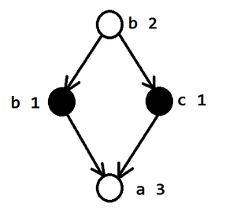
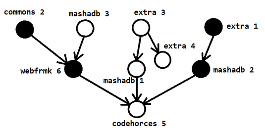

<h1 style='text-align: center;'> C. Dependency management</h1>

<h5 style='text-align: center;'>time limit per test: 4 seconds</h5>
<h5 style='text-align: center;'>memory limit per test: 256 megabytes</h5>

Polycarp is currently developing a project in Vaja language and using a popular dependency management system called Vamen. From Vamen's point of view both Vaja project and libraries are treated projects for simplicity.

A project in Vaja has its own uniqie non-empty name consisting of lowercase latin letters with length not exceeding 10 and version — positive integer from 1 to 106. Each project (keep in mind that it is determined by both its name and version) might depend on other projects. For sure, there are no cyclic dependencies.

You're given a list of project descriptions. The first of the given projects is the one being developed by Polycarp at this moment. Help Polycarp determine all projects that his project depends on (directly or via a certain chain). 

It's possible that Polycarp's project depends on two different versions of some project. In this case collision resolving is applied, i.e. for each such project the system chooses the version that minimizes the distance from it to Polycarp's project. If there are several options, the newer (with the maximum version) is preferred. This version is considered actual; other versions and their dependencies are ignored.

More formal, choose such a set of projects of minimum possible size that the following conditions hold: 

* Polycarp's project is chosen;
* Polycarp's project depends (directly or indirectly) on all other projects in the set;
* no two projects share the name;
* for each project *x* that some other project in the set depends on we have either *x* or some *y* with other version and shorter chain to Polycarp's project chosen. In case of ties the newer one is chosen.

## Output

 all Polycarp's project's dependencies (Polycarp's project itself should't be printed) in lexicographical order.

## Input

The first line contains an only integer *n* (1 ≤ *n* ≤ 1 000) — the number of projects in Vaja.

The following lines contain the project descriptions. Each project is described by a line consisting of its name and version separated by space. The next line gives the number of direct dependencies (from 0 to *n* - 1) and the dependencies themselves (one in a line) in arbitrary order. Each dependency is specified by its name and version. The projects are also given in arbitrary order, but the first of them is always Polycarp's. Project descriptions are separated by one empty line. Refer to samples for better understanding.

It's guaranteed that there are no cyclic dependencies. 

## Output

## Output

 all Polycarp's project's dependencies in lexicographical order.

## Examples

## Input


```
4  
a 3  
2  
b 1  
c 1  
   
b 2  
0  
   
b 1  
1  
b 2  
   
c 1  
1  
b 2  

```
## Output


```
2  
b 1  
c 1  

```
## Input


```
9  
codehorses 5  
3  
webfrmk 6  
mashadb 1  
mashadb 2  
   
commons 2  
0  
   
mashadb 3  
0  
   
webfrmk 6  
2  
mashadb 3  
commons 2  
   
extra 4  
1  
extra 3  
   
extra 3  
0  
   
extra 1  
0  
   
mashadb 1  
1  
extra 3  
   
mashadb 2  
1  
extra 1  

```
## Output


```
4  
commons 2  
extra 1  
mashadb 2  
webfrmk 6  

```
## Input


```
3  
abc 1  
2  
abc 3  
cba 2  
  
abc 3  
0  
  
cba 2  
0  

```
## Output


```
1  
cba 2  

```
## Note

The first sample is given in the pic below. Arrow from *A* to *B* means that *B* directly depends on *A*. Projects that Polycarp's project «a» (version 3) depends on are painted black.

  The second sample is again given in the pic below. Arrow from *A* to *B* means that *B* directly depends on *A*. Projects that Polycarp's project «codehorses» (version 5) depends on are paint it black. ## Note

 that «extra 1» is chosen instead of «extra 3» since «mashadb 1» and all of its dependencies are ignored due to «mashadb 2».

  

#### tags 

#1900 #*special #graphs #implementation 