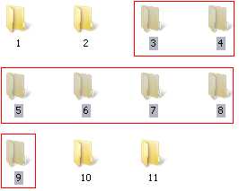
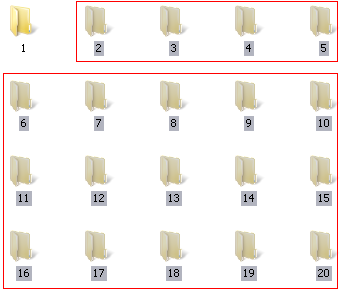

<h1 style='text-align: center;'> A. Frames</h1>

<h5 style='text-align: center;'>time limit per test: 2 seconds</h5>
<h5 style='text-align: center;'>memory limit per test: 256 megabytes</h5>

Throughout Igor K.'s life he has had many situations worthy of attention. We remember the story with the virus, the story of his mathematical career and of course, his famous programming achievements. However, one does not always adopt new hobbies, one can quit something as well.

This time Igor K. got disappointed in one of his hobbies: editing and voicing videos. Moreover, he got disappointed in it so much, that he decided to destroy his secret archive for good. 

Igor K. use Pindows XR operation system which represents files and folders by small icons. At that, *m* icons can fit in a horizontal row in any window.

Igor K.'s computer contains *n* folders in the D: disk's root catalog. The folders are numbered from 1 to *n* in the order from the left to the right and from top to bottom (see the images). At that the folders with secret videos have numbers from *a* to *b* inclusive. Igor K. wants to delete them forever, at that making as few frame selections as possible, and then pressing Shift+Delete exactly once. What is the minimum number of times Igor K. will have to select the folder in order to select folders from *a* to *b* and only them? Let us note that if some selected folder is selected repeatedly, then it is deselected. Each selection possesses the shape of some rectangle with sides parallel to the screen's borders.

## Input

The only line contains four integers *n*, *m*, *a*, *b* (1 ≤ *n*, *m* ≤ 109, 1 ≤ *a* ≤ *b* ≤ *n*). They are the number of folders in Igor K.'s computer, the width of a window and the numbers of the first and the last folders that need to be deleted.

## Output

Print a single number: the least possible number of times Igor K. will have to select the folders using frames to select only the folders with numbers from *a* to *b*.

## Examples

## Input


```
11 4 3 9  

```
## Output


```
3  

```
## Input


```
20 5 2 20  

```
## Output


```
2  

```
## Note

The images below illustrate statement tests.

The first test:



In this test we can select folders 3 and 4 with out first selection, folders 5, 6, 7, 8 with our second selection and folder 9 with our third, last selection.

The second test:



In this test we can first select all folders in the first row (2, 3, 4, 5), then — all other ones.


#### tags 

#1700 #implementation 