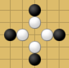

<h1 style='text-align: center;'> D. Game with Tokens</h1>

<h5 style='text-align: center;'>time limit per test: 2 seconds</h5>
<h5 style='text-align: center;'>memory limit per test: 256 megabytes</h5>

Consider the following game for two players. There is one white token and some number of black tokens. Each token is placed on a plane in a point with integer coordinates *x* and *y*.

The players take turn making moves, white starts. On each turn, a player moves all tokens of their color by 1 to up, down, left or right. Black player can choose directions for each token independently.

After a turn of the white player the white token can not be in a point where a black token is located. There are no other constraints on locations of the tokens: positions of black tokens can coincide, after a turn of the black player and initially the white token can be in the same point with some black point. If at some moment the white player can't make a move, he loses. If the white player makes 10100500 moves, he wins.

You are to solve the following problem. You are given initial positions of all black tokens. It is guaranteed that initially all these positions are distinct. In how many places can the white token be located initially so that if both players play optimally, the black player wins?

## Input

The first line contains a single integer *n* (1 ≤ *n* ≤ 105) — the number of black points.

The (*i* + 1)-th line contains two integers *x**i*, *y**i* ( - 105 ≤ *x**i*, *y**i*,  ≤ 105) — the coordinates of the point where the *i*-th black token is initially located.

It is guaranteed that initial positions of black tokens are distinct.

## Output

Print the number of points where the white token can be located initially, such that if both players play optimally, the black player wins.

## Examples

## Input


```
4  
-2 -1  
0 1  
0 -3  
2 -1  

```
## Output


```
4  

```
## Input


```
4  
-2 0  
-1 1  
0 -2  
1 -1  

```
## Output


```
2  

```
## Input


```
16  
2 1  
1 2  
-1 1  
0 1  
0 0  
1 1  
2 -1  
2 0  
1 0  
-1 -1  
1 -1  
2 2  
0 -1  
-1 0  
0 2  
-1 2  

```
## Output


```
4  

```
## Note

In the first and second examples initial positions of black tokens are shown with black points, possible positions of the white token (such that the black player wins) are shown with white points.

The first example: 

The second example: 

In the third example the white tokens should be located in the inner square 2 × 2, to make the black player win. 


#### tags 

#2500 #data_structures #games #implementation 