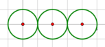
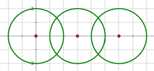
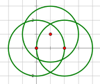

<h1 style='text-align: center;'> C. A Colourful Prospect</h1>

<h5 style='text-align: center;'>time limit per test: 1 second</h5>
<h5 style='text-align: center;'>memory limit per test: 256 megabytes</h5>

Firecrackers scare Nian the monster, but they're wayyyyy too noisy! Maybe fireworks make a nice complement.

Little Tommy is watching a firework show. As circular shapes spread across the sky, a splendid view unfolds on the night of Lunar New Year's eve.

A wonder strikes Tommy. How many regions are formed by the circles on the sky? We consider the sky as a flat plane. A region is a connected part of the plane with positive area, whose bound consists of parts of bounds of the circles and is a curve or several curves without self-intersections, and that does not contain any curve other than its boundaries. ## Note

 that exactly one of the regions extends infinitely.

## Input

The first line of input contains one integer *n* (1 ≤ *n* ≤ 3), denoting the number of circles.

The following *n* lines each contains three space-separated integers *x*, *y* and *r* ( - 10 ≤ *x*, *y* ≤ 10, 1 ≤ *r* ≤ 10), describing a circle whose center is (*x*, *y*) and the radius is *r*. No two circles have the same *x*, *y* and *r* at the same time.

## Output

Print a single integer — the number of regions on the plane.

## Examples

## Input


```
3  
0 0 1  
2 0 1  
4 0 1  

```
## Output


```
4  

```
## Input


```
3  
0 0 2  
3 0 2  
6 0 2  

```
## Output


```
6  

```
## Input


```
3  
0 0 2  
2 0 2  
1 1 2  

```
## Output


```
8  

```
## Note

For the first example,

  For the second example,

  For the third example,

  

#### tags 

#2700 #geometry #graphs 