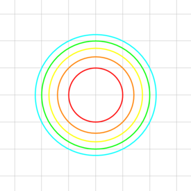
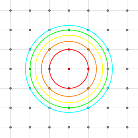

<h1 style='text-align: center;'> D. A Creative Cutout</h1>

<h5 style='text-align: center;'>time limit per test: 2 seconds</h5>
<h5 style='text-align: center;'>memory limit per test: 256 megabytes</h5>

Everything red frightens Nian the monster. So do red paper and... you, red on Codeforces, potential or real.

Big Banban has got a piece of paper with endless lattice points, where lattice points form squares with the same area. His most favorite closed shape is the circle because of its beauty and simplicity. Once he had obtained this piece of paper, he prepares it for paper-cutting.

  He drew *n* concentric circles on it and numbered these circles from 1 to *n* such that the center of each circle is the same lattice point and the radius of the *k*-th circle is  times the length of a lattice edge.

Define the degree of beauty of a lattice point as the summation of the indices of circles such that this lattice point is inside them, or on their bounds. Banban wanted to ask you the total degree of beauty of all the lattice points, but changed his mind.

Defining the total degree of beauty of all the lattice points on a piece of paper with *n* circles as *f*(*n*), you are asked to figure out .

## Input

The first line contains one integer *m* (1 ≤ *m* ≤ 1012).

## Output

In the first line print one integer representing .

## Examples

## Input


```
5  

```
## Output


```
387  

```
## Input


```
233  

```
## Output


```
788243189  

```
## Note

A piece of paper with 5 circles is shown in the following.

  There are 5 types of lattice points where the degree of beauty of each red point is 1 + 2 + 3 + 4 + 5 = 15, the degree of beauty of each orange point is 2 + 3 + 4 + 5 = 14, the degree of beauty of each green point is 4 + 5 = 9, the degree of beauty of each blue point is 5 and the degree of beauty of each gray point is 0. Therefore, *f*(5) = 5·15 + 4·14 + 4·9 + 8·5 = 207.

Similarly, *f*(1) = 5, *f*(2) = 23, *f*(3) = 50, *f*(4) = 102 and consequently .


#### tags 

#2900 #brute_force #combinatorics #math 