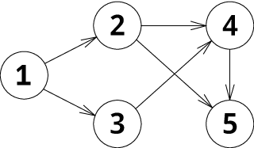

<h1 style='text-align: center;'> B. Sleepy Game</h1>

<h5 style='text-align: center;'>time limit per test: 2 seconds</h5>
<h5 style='text-align: center;'>memory limit per test: 256 megabytes</h5>

Petya and Vasya arranged a game. The game runs by the following rules. Players have a directed graph consisting of *n* vertices and *m* edges. One of the vertices contains a chip. Initially the chip is located at vertex *s*. Players take turns moving the chip along some edge of the graph. Petya goes first. Player who can't move the chip loses. If the game lasts for 106 turns the draw is announced.

Vasya was performing big laboratory work in "Spelling and parts of speech" at night before the game, so he fell asleep at the very beginning of the game. Petya decided to take the advantage of this situation and make both Petya's and Vasya's moves.

Your task is to help Petya find out if he can win the game or at least draw a tie.

## Input

The first line of input contain two integers *n* and *m* — the number of vertices and the number of edges in the graph (2 ≤ *n* ≤ 105, 0 ≤ *m* ≤ 2·105).

The next *n* lines contain the information about edges of the graph. *i*-th line (1 ≤ *i* ≤ *n*) contains nonnegative integer *c**i* — number of vertices such that there is an edge from *i* to these vertices and *c**i* distinct integers *a**i*, *j* — indices of these vertices (1 ≤ *a**i*, *j* ≤ *n*, *a**i*, *j* ≠ *i*).

It is guaranteed that the total sum of *c**i* equals to *m*.

The next line contains index of vertex *s* — the initial position of the chip (1 ≤ *s* ≤ *n*).

## Output

If Petya can win print «Win» in the first line. In the next line print numbers *v*1, *v*2, ..., *v**k* (1 ≤ *k* ≤ 106) — the sequence of vertices Petya should visit for the winning. Vertex *v*1 should coincide with *s*. For *i* = 1... *k* - 1 there should be an edge from *v**i* to *v**i* + 1 in the graph. There must be no possible move from vertex *v**k*. The sequence should be such that Petya wins the game.

If Petya can't win but can draw a tie, print «Draw» in the only line. Otherwise print «Lose».

## Examples

## Input


```
5 6  
2 2 3  
2 4 5  
1 4  
1 5  
0  
1  

```
## Output


```
Win  
1 2 4 5   

```
## Input


```
3 2  
1 3  
1 1  
0  
2  

```
## Output


```
Lose  

```
## Input


```
2 2  
1 2  
1 1  
1  

```
## Output


```
Draw  

```
## Note

In the first example the graph is the following:

  Initially the chip is located at vertex 1. In the first move Petya moves the chip to vertex 2, after that he moves it to vertex 4 for Vasya. After that he moves to vertex 5. Now it is Vasya's turn and there is no possible move, so Petya wins.

In the second example the graph is the following:

  Initially the chip is located at vertex 2. The only possible Petya's move is to go to vertex 1. After that he has to go to 3 for Vasya. Now it's Petya's turn but he has no possible move, so Petya loses.

In the third example the graph is the following:

  Petya can't win, but he can move along the cycle, so the players will draw a tie.


#### tags 

#2100 #dfs_and_similar #dp #games #graphs 