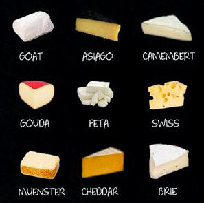

<h1 style='text-align: center;'> E. Cheese Board</h1>

<h5 style='text-align: center;'>time limit per test: 1 second</h5>
<h5 style='text-align: center;'>memory limit per test: 256 megabytes</h5>

Not to be confused with [chessboard](https://en.wikipedia.org/wiki/Chessboard).

  ## Input

The first line of input contains a single integer *N* (1 ≤ *N* ≤ 100) — the number of cheeses you have.

The next *N* lines describe the cheeses you have. Each line contains two space-separated strings: the name of the cheese and its type. The name is a string of lowercase English letters between 1 and 10 characters long. The type is either "soft" or "hard. All cheese names are distinct.

## Output

## Output

 a single number.

## Examples

## Input


```
9  
brie soft  
camembert soft  
feta soft  
goat soft  
muenster soft  
asiago hard  
cheddar hard  
gouda hard  
swiss hard  

```
## Output


```
3  

```
## Input


```
6  
parmesan hard  
emmental hard  
edam hard  
colby hard  
gruyere hard  
asiago hard  

```
## Output


```
4  

```


#### tags 

#2000 