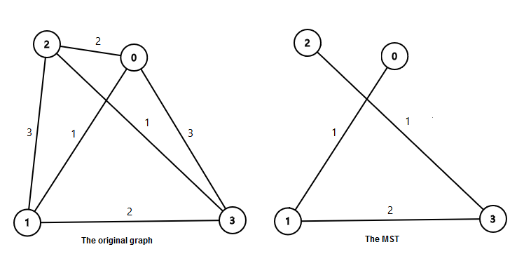

<h1 style='text-align: center;'> E. Mahmoud and Ehab and the xor-MST</h1>

<h5 style='text-align: center;'>time limit per test: 2 seconds</h5>
<h5 style='text-align: center;'>memory limit per test: 256 megabytes</h5>

Ehab is interested in the bitwise-xor operation and the special graphs. Mahmoud gave him a problem that combines both. He has a complete graph consisting of *n* vertices numbered from 0 to *n* - 1. For all 0 ≤ *u* < *v* < *n*, vertex *u* and vertex *v* are connected with an undirected edge that has weight  (where  is the [bitwise-xor operation](https://en.wikipedia.org/wiki/Bitwise_operation#XOR)). Can you find the weight of the minimum spanning tree of that graph?

You can read about complete graphs in <https://en.wikipedia.org/wiki/Complete_graph>

You can read about the minimum spanning tree in <https://en.wikipedia.org/wiki/Minimum_spanning_tree>

The weight of the minimum spanning tree is the sum of the weights on the edges included in it.

## Input

The only line contains an integer *n* (2 ≤ *n* ≤ 1012), the number of vertices in the graph.

## Output

The only line contains an integer *x*, the weight of the graph's minimum spanning tree.

## Example

## Input


```
4  

```
## Output


```
4
```
## Note

In the first sample:  The weight of the minimum spanning tree is 1+2+1=4.


#### tags 

#1900 #bitmasks #dp #graphs #implementation #math 