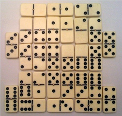

<h1 style='text-align: center;'> A. Domino</h1>

<h5 style='text-align: center;'>time limit per test: 0.5 second</h5>
<h5 style='text-align: center;'>memory limit per test: 256 megabytes</h5>

Little Gennady was presented with a set of domino for his birthday. The set consists of 28 different dominoes of size 2 × 1. Both halves of each domino contain one digit from 0 to 6. 


```
0-0 0-1 0-2 0-3 0-4 0-5 0-6  
1-1 1-2 1-3 1-4 1-5 1-6  
2-2 2-3 2-4 2-5 2-6  
3-3 3-4 3-5 3-6  
4-4 4-5 4-6  
5-5 5-6  
6-6  

```
The figure that consists of 28 dominoes is called magic, if it can be fully covered with 14 non-intersecting squares of size 2 × 2 so that each square contained four equal numbers. Every time Gennady assembles a magic figure, some magic properties of the set appear — he wins the next contest. Gennady noticed that he can't assemble a figure that has already been assembled, otherwise someone else wins the contest.

  Gennady chose a checked field of size *n* × *m* and put there rectangular chips of sizes 1 × 2 and 2 × 1. Each chip fully occupies exactly two neighboring squares of the field. Those chips do not overlap but they can touch each other. Overall the field has exactly 28 chips, equal to the number of dominoes in the set. Now Gennady wants to replace each chip with a domino so that a magic figure appeared as a result. Different chips should be replaced by different dominoes. Determine in what number of contests Gennady can win over at the given position of the chips. You are also required to find one of the possible ways of replacing chips with dominoes to win the next Codeforces round.

## Input

The first line contains two positive integers *n* and *m* (1 ≤ *n*, *m* ≤ 30). Each of the following *n* lines contains *m* characters, which is the position of chips on the field. The dots stand for empty spaces, Latin letters from "a" to "z" and "A", "B" stand for the positions of the chips. There are exactly 28 chips on the field. The squares covered by the same chip are marked by the same letter, different chips are marked by different letters. It is guaranteed that the field's description is correct.

It is also guaranteed that at least one solution exists.

## Output

Print on the first line the number of ways to replace chips with dominoes to get a magic figure. That is the total number of contests that can be won using this arrangement of the chips. Next *n* lines containing *m* characters each, should contain a field from dots and numbers from 0 to 6 — any of the possible solutions. All dominoes should be different.

## Examples

## Input


```
8 8  
.aabbcc.  
.defghi.  
kdefghij  
klmnopqj  
.lmnopq.  
.rstuvw.  
xrstuvwy  
xzzAABBy  

```
## Output


```
10080  
.001122.  
.001122.  
33440055  
33440055  
.225566.  
.225566.  
66113344  
66113344  

```


#### tags 

#2400 #brute_force #implementation 