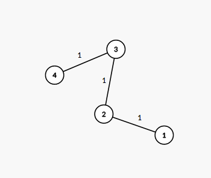
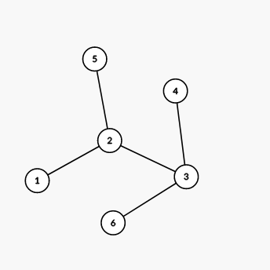
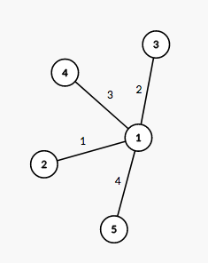

<h1 style='text-align: center;'> C. Useful Decomposition</h1>

<h5 style='text-align: center;'>time limit per test: 1 second</h5>
<h5 style='text-align: center;'>memory limit per test: 256 megabytes</h5>

Ramesses knows a lot about problems involving trees (undirected connected graphs without cycles)!

He created a new useful tree decomposition, but he does not know how to construct it, so he asked you for help!

The decomposition is the splitting the edges of the tree in some simple paths in such a way that each two paths have at least one common vertex. Each edge of the tree should be in exactly one path.

Help Remesses, find such a decomposition of the tree or derermine that there is no such decomposition.

## Input

The first line contains a single integer $n$ ($2 \leq n \leq 10^{5}$) the number of nodes in the tree.

Each of the next $n - 1$ lines contains two integers $a_i$ and $b_i$ ($1 \leq a_i, b_i \leq n$, $a_i \neq b_i$) — the edges of the tree. It is guaranteed that the given edges form a tree.

## Output

If there are no decompositions, print the only line containing "No".

Otherwise in the first line print "Yes", and in the second line print the number of paths in the decomposition $m$. 

Each of the next $m$ lines should contain two integers $u_i$, $v_i$ ($1 \leq u_i, v_i \leq n$, $u_i \neq v_i$) denoting that one of the paths in the decomposition is the simple path between nodes $u_i$ and $v_i$. 

Each pair of paths in the decomposition should have at least one common vertex, and each edge of the tree should be presented in exactly one path. You can print the paths and the ends of each path in arbitrary order.

If there are multiple decompositions, print any.

## Examples

## Input


```
4  
1 2  
2 3  
3 4  

```
## Output


```
Yes  
1  
1 4  

```
## Input


```
6  
1 2  
2 3  
3 4  
2 5  
3 6  

```
## Output


```
No  

```
## Input


```
5  
1 2  
1 3  
1 4  
1 5  

```
## Output


```
Yes  
4  
1 2  
1 3  
1 4  
1 5  

```
## Note

The tree from the first example is shown on the picture below:  The number next to each edge corresponds to the path number in the decomposition. It is easy to see that this decomposition suits the required conditions.

The tree from the second example is shown on the picture below:  We can show that there are no valid decompositions of this tree.

The tree from the third example is shown on the picture below:  The number next to each edge corresponds to the path number in the decomposition. It is easy to see that this decomposition suits the required conditions.


#### tags 

#1400 #implementation #trees 