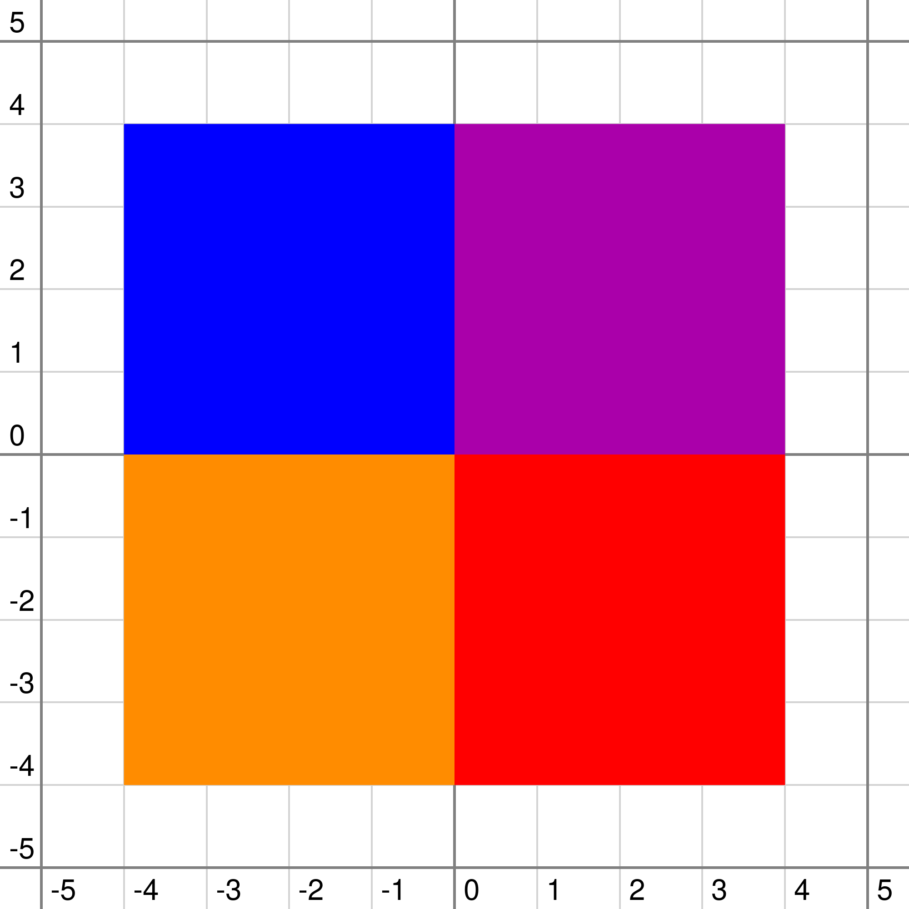
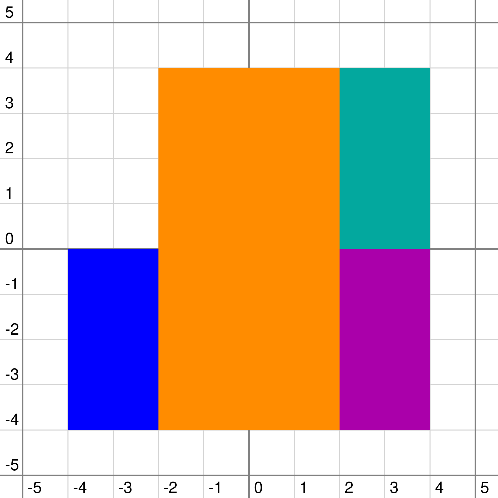

<h1 style='text-align: center;'> D. Arkady and Rectangles</h1>

<h5 style='text-align: center;'>time limit per test: 4 seconds</h5>
<h5 style='text-align: center;'>memory limit per test: 256 megabytes</h5>

Arkady has got an infinite plane painted in color $0$. Then he draws $n$ rectangles filled with paint with sides parallel to the Cartesian coordinate axes, one after another. The color of the $i$-th rectangle is $i$ (rectangles are enumerated from $1$ to $n$ in the order he draws them). It is possible that new rectangles cover some of the previous ones completely or partially.

Count the number of different colors on the plane after Arkady draws all the rectangles.

## Input

The first line contains a single integer $n$ ($1 \le n \le 100\,000$) — the number of rectangles.

The $i$-th of the next $n$ lines contains $4$ integers $x_1$, $y_1$, $x_2$ and $y_2$ ($-10^9 \le x_1 < x_2 \le 10^9$, $-10^9 \le y_1 < y_2 \le 10^9$) — the coordinates of corners of the $i$-th rectangle.

## Output

In the single line print the number of different colors in the plane, including color $0$.

## Examples

## Input


```
5  
-1 -1 1 1  
-4 0 0 4  
0 0 4 4  
-4 -4 0 0  
0 -4 4 0  

```
## Output


```
5
```
## Input


```
4  
0 0 4 4  
-4 -4 0 0  
0 -4 4 0  
-2 -4 2 4  

```
## Output


```
5
```
## Note

  That's how the plane looks in the first sample That's how the plane looks in the second sample

$0$ = white, $1$ = cyan, $2$ = blue, $3$ = purple, $4$ = yellow, $5$ = red. 


#### tags 

#3300 #data_structures 