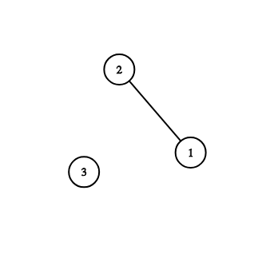
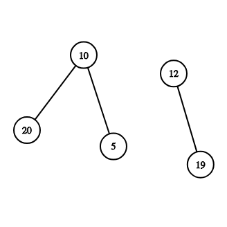

<h1 style='text-align: center;'> C. AND Graph</h1>

<h5 style='text-align: center;'>time limit per test: 4 seconds</h5>
<h5 style='text-align: center;'>memory limit per test: 256 megabytes</h5>

You are given a set of size $m$ with integer elements between $0$ and $2^{n}-1$ inclusive. Let's build an undirected graph on these integers in the following way: connect two integers $x$ and $y$ with an edge if and only if $x \\& y = 0$. Here $\\&$ is the [bitwise AND operation](https://en.wikipedia.org/wiki/Bitwise_operation#AND). Count the number of connected components in that graph.

## Input

In the first line of input there are two integers $n$ and $m$ ($0 \le n \le 22$, $1 \le m \le 2^{n}$).

In the second line there are $m$ integers $a_1, a_2, \ldots, a_m$ ($0 \le a_{i} < 2^{n}$) — the elements of the set. All $a_{i}$ are distinct.

## Output

Print the number of connected components.

## Examples

## Input


```
2 3  
1 2 3  

```
## Output


```
2  

```
## Input


```
5 5  
5 19 10 20 12  

```
## Output


```
2  

```
## Note

Graph from first sample:



Graph from second sample:




#### tags 

#2500 #bitmasks #dfs_and_similar #dsu #graphs 