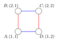
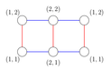
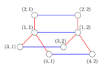

<h1 style='text-align: center;'> D. Cycles in product</h1>

<h5 style='text-align: center;'>time limit per test: 7 seconds</h5>
<h5 style='text-align: center;'>memory limit per test: 256 megabytes</h5>

Consider a tree (that is, an undirected connected graph without loops) $T_1$ and a tree $T_2$. Let's define their cartesian product $T_1 \times T_2$ in a following way.

Let $V$ be the set of vertices in $T_1$ and $U$ be the set of vertices in $T_2$.

Then the set of vertices of graph $T_1 \times T_2$ is $V \times U$, that is, a set of ordered pairs of vertices, where the first vertex in pair is from $V$ and the second — from $U$.

Let's draw the following edges:

* Between $(v, u_1)$ and $(v, u_2)$ there is an undirected edge, if $u_1$ and $u_2$ are adjacent in $U$.
* Similarly, between $(v_1, u)$ and $(v_2, u)$ there is an undirected edge, if $v_1$ and $v_2$ are adjacent in $V$.

Please see the notes section for the pictures of products of trees in the sample tests.

Let's examine the graph $T_1 \times T_2$. How much cycles (not necessarily simple) of length $k$ it contains? Since this number can be very large, print it modulo $998244353$.

The sequence of vertices $w_1$, $w_2$, ..., $w_k$, where $w_i \in V \times U$ called cycle, if any neighboring vertices are adjacent and $w_1$ is adjacent to $w_k$. Cycles that differ only by the cyclic shift or direction of traversal are still considered different.

## Input

First line of input contains three integers — $n_1$, $n_2$ and $k$ ($2 \le n_1, n_2 \le 4000$, $2 \le k \le 75$) — number of vertices in the first tree, number of vertices in the second tree and the cycle length respectively.

Then follow $n_1 - 1$ lines describing the first tree. Each of this lines contains two integers — $v_i, u_i$ ($1 \le v_i, u_i \le n_1$), which define edges of the first tree.

Then follow $n_2 - 1$ lines, which describe the second tree in the same format.

It is guaranteed, that given graphs are trees.

## Output

Print one integer — number of cycles modulo $998244353$.

## Examples

## Input


```
2 2 2  
1 2  
1 2  

```
## Output


```
8  

```
## Input


```
2 2 4  
1 2  
1 2  

```
## Output


```
32  

```
## Input


```
2 3 4  
1 2  
1 2  
1 3  

```
## Output


```
70  

```
## Input


```
4 2 2  
1 2  
1 3  
1 4  
1 2  

```
## Output


```
20  

```
## Note

The following three pictures illustrate graph, which are products of the trees from sample tests.

In the first example, the list of cycles of length $2$ is as follows:

* «AB», «BA»
* «BC», «CB»
* «AD», «DA»
* «CD», «DC»

    

#### tags 

#2900 #combinatorics #divide_and_conquer #trees 