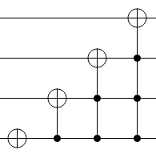

<h1 style='text-align: center;'> C. Mystery Circuit</h1>

<h5 style='text-align: center;'>time limit per test: 1 second</h5>
<h5 style='text-align: center;'>memory limit per test: 256 megabytes</h5>

  ## Input

The input contains a single integer $a$ ($0 \le a \le 15$).

## Output

## Output

 a single integer.

## Example

## Input


```

3

```
## Output


```

13

```


#### tags 

#bitmasks #brute_force 