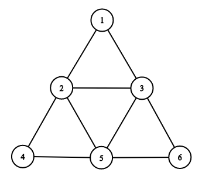

<h1 style='text-align: center;'> G. Graph Decomposition</h1>

<h5 style='text-align: center;'>time limit per test: 6 seconds</h5>
<h5 style='text-align: center;'>memory limit per test: 256 megabytes</h5>

You are given an undirected graph consisting of $n$ vertices and $m$ edges.

Recall that a cycle is a path that starts and ends in the same vertex. A cycle in a graph is called simple if it contains each vertex (except the starting and ending one) no more than once (the starting and the ending one is contained always twice). ## Note

 that loops are considered to be simple cycles.

In one move you can choose any simple cycle in this graph and erase the edges corresponding to this cycle (corresponding vertices remain in the graph). It is allowed to erase the loop or two copies of the same edge (take a look at examples).

Your problem is to apply some sequence of moves to obtain the graph without edges. It is not necessary to minimize the number of cycles. If it is impossible, print "NO".

## Input

The first line of the input contains two integers $n$ and $m$ ($1 \le n, m \le 2 \cdot 10^5$) — the number of vertices and the number of edges in the graph.

The next $m$ lines contain edges of the graph. The $i$-th line contains the $i$-th edge $x_i, y_i$ ($1 \le x_i, y_i \le n$), where $x_i$ and $y_i$ are vertices connected by the $i$-th edge. The graph can contain loops or multiple edges.

## Output

If it is impossible to decompose the given graph into simple cycles, print "NO" in the first line.

Otherwise print "YES" in the first line. In the second line print $k$ — the number of simple cycles in the graph decomposition.

In the next $k$ lines print cycles themselves. The $j$-th line should contain the $j$-th cycle. First, print $c_j$ — the number of vertices in the $j$-th cycle. Then print the cycle as a sequence of vertices. All neighbouring (adjacent) vertices in the printed path should be connected by an edge that isn't contained in other cycles.

## Examples

## Input


```

6 9
1 2
2 3
1 3
2 4
2 5
4 5
3 5
3 6
5 6

```
## Output


```

YES
3
4 2 5 4 2 
4 3 6 5 3 
4 1 3 2 1 

```
## Input


```

4 7
1 1
1 2
2 3
3 4
4 1
1 3
1 3

```
## Output


```

YES
3
2 1 1 
5 1 4 3 2 1 
3 1 3 1 

```
## Input


```

4 8
1 1
1 2
2 3
3 4
4 1
2 4
1 3
1 3

```
## Output


```

NO

```
## Note

The picture corresponding to the first example: 


#### tags 

#*special #graphs 