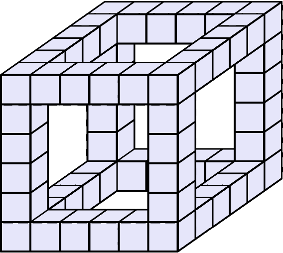
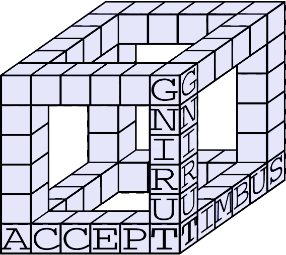

<h1 style='text-align: center;'> C. Cubeword</h1>

<h5 style='text-align: center;'>time limit per test: 1.7 seconds</h5>
<h5 style='text-align: center;'>memory limit per test: 1024 megabytes</h5>

A cubeword is a special type of a crossword. When building a cubeword, you start by choosing a positive integer $a$: the side length of the cube. Then, you build a big cube consisting of $a \times a \times a$ unit cubes. This big cube has 12 edges. Then, you discard all unit cubes that do not touch the edges of the big cube. The figure below shows the object you will get for $a=6$.

  Finally, you assign a letter to each of the unit cubes in the object. You must get a meaningful word along each edge of the big cube. Each edge can be read in either direction, and it is sufficient if one of the two directions of reading gives a meaningful word.

The figure below shows the object for $a=6$ in which some unit cubes already have assigned letters. You can already read the words 'SUBMIT', 'ACCEPT' and 'TURING' along three edges of the big cube.

  You are given a list of valid words. Each word from the wordlist may appear on arbitrarily many edges of a valid cubeword. Find and report the number of different cubewords that can be constructed, modulo $998,244,353$.

If one cubeword can be obtained from another by rotation or mirroring, they are considered distinct.

## Input

The first line contains a single integer $n$ ($1 \leq n \leq 100,000$) – the number of words.

Then, $n$ lines follow. Each of these lines contains one word that can appear on the edges of the big cube. The length of each word is between 3 and 10, inclusive.

It is guaranteed that all words are different.

## Output

## Output

 a single integer, the number of distinct cubewords for the given list of valid words modulo $998,244,353$.

## Scoring

Subtask 1 (21 points): the words consist only of letters 'a' - 'f' (lowercase)

Subtask 2 (29 points): the words consist only of letters 'a' - 'p' (lowercase)

Subtask 3 (34 points): the words consist of letters 'a' - 'p' (lowercase) and 'A' - 'P' (uppercase)

Subtask 4 (16 points): the words consist of letters 'a' - 'z' (lowercase), 'A' - 'Z' (uppercase) and digits '0' - '9'

## Examples

## Input


```

1
radar

```
## Output


```

1

```
## Input


```

1
robot

```
## Output


```

2

```
## Input


```

2
FLOW
WOLF

```
## Output


```

2

```
## Input


```

2
baobab
bob

```
## Output


```

4097

```
## Input


```

3
TURING
SUBMIT
ACCEPT

```
## Output


```

162

```
## Input


```

3
MAN1LA
MAN6OS
AN4NAS

```
## Output


```

114

```
## Note

In the first sample, the only possibility is for the word "radar" to be on each edge of the cube.

In the second sample, there are two cubes, which are just rotations of each other – the word "robot" is on every edge, and the difference between the two cubes is whether the lower left front corner contains 'r' or 't'.

The third sample is similar to the second one. The fact that we can read the word on each edge in both directions does not affect the answer.

In the fourth sample, there is one cube with the word "bob" on each edge. There are also $2^{12} = 4096$ cubes with the word "baobab" on each edge. (For each of the 12 edges, we have two possible directions in which the word "baobab" can appear.)


#### tags 

#*special #brute_force #dp #meet-in-the-middle 