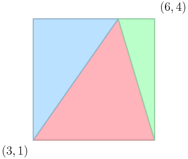
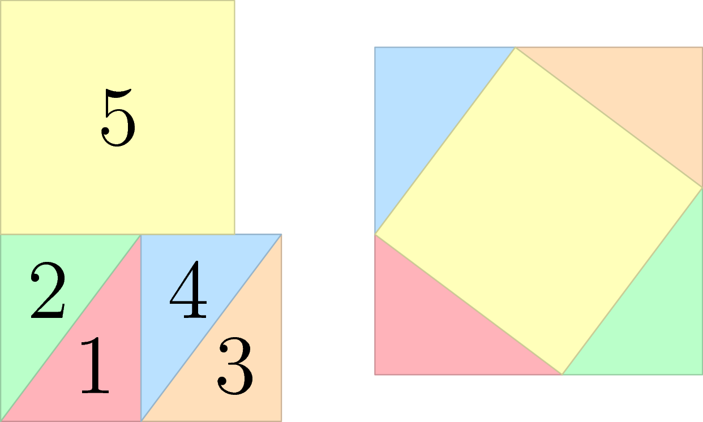

<h1 style='text-align: center;'> C. Scissors and Tape</h1>

<h5 style='text-align: center;'>time limit per test: 1 second</h5>
<h5 style='text-align: center;'>memory limit per test: 1024 megabytes</h5>

You are given a piece of paper in the shape of a simple polygon $S$. Your task is to turn it into a simple polygon $T$ that has the same area as $S$.

You can use two tools: scissors and tape. Scissors can be used to cut any polygon into smaller polygonal pieces. Tape can be used to combine smaller pieces into larger polygons. You can use each tool multiple times, in any order. 

The polygons given in the input have integer coordinates, but you are allowed to produce shapes with non-integer coordinates in your output.

A formal definition of the task follows.

A shape $Q=(Q_0,\dots,Q_{n-1})$ is a sequence of three or more points in the plane such that: 

* The closed polyline $Q_0Q_1Q_2\dots Q_{n-1}Q_0$ never touches or intersects itself, and therefore it forms the boundary of a simple polygon.
* The polyline goes around the boundary of the polygon in the counter-clockwise direction.

The polygon whose boundary is the shape $Q$ will be denoted $P(Q)$.

Two shapes are called equivalent if one can be translated and/or rotated to become identical with the other.

## Note

 that mirroring a shape is not allowed. Also note that the order of points matters: the shape $(Q_1,\dots,Q_{n-1},Q_0)$ is not necessarily equivalent to the shape $(Q_0,\dots,Q_{n-1})$.


In the figure on the left: Shapes $U$ and $V$ are equivalent. Shape $W$ is not equivalent with them because the points of $W$ are given in a different order. Regardless of the order of points, the fourth shape is not equivalent with the previous ones either as flipping a shape is not allowed.

In both input and output, a shape with $n$ points is represented as a single line that contains $2n+1$ space-separated numbers: the number $n$ followed by the coordinates of the points: $Q_{0,x}$, $Q_{0,y}$, $Q_{1,x}$, ...

Shapes have identification numbers (IDs). The given shape $S$ has ID 0, the shapes you produce in your solutions are given IDs 1, 2, 3, ..., in the order in which they are produced.

Shapes $B_1,\dots,B_k$ form a subdivision of shape $A$ if: 

* The union of all $P(B_i)$ is exactly $P(A)$.
* For each $i\neq j$, the area of the intersection of $P(B_i)$ and $P(B_j)$ is zero.

The scissors operation destroys one existing shape $A$ and produces one or more shapes $B_1,\dots,B_k$ that form a subdivision of $A$.



In the figure: Shape $A$ (square) subdivided into shapes $B_1$, $B_2$, $B_3$ (the three triangles). One valid way to describe one of the $B_i$ is "3 3 1 6 1 5.1 4".

The tape operation destroys one or more existing shapes $A_1,\dots,A_k$ and produces one new shape $B$. In order to perform this operation, you must first specify shapes $C_1,\dots,C_k$ and only then the final shape $B$. These shapes must satisfy the following: 

* For each $i$, the shape $C_i$ is equivalent to the shape $A_i$.
* The shapes $C_1,\dots,C_k$ form a subdivision of the shape $B$.

Informally, you choose the shape $B$ and show how to move each of the existing $A_i$ to its correct location $C_i$ within $B$. ## Note

 that only the shape $B$ gets a new ID, the shapes $C_i$ do not.

## Input

The first line contains the source shape $S$.

The second line contains the target shape $T$.

Each shape has between 3 and 10 points, inclusive. Both shapes are given in the format specified above.

All coordinates in the input are integers between $-10^6$ and $10^6$, inclusive.

In each shape, no three points form an angle smaller than 3 degrees. (This includes non-consecutive points and implies that no three points are collinear.)

The polygons $P(S)$ and $P(T)$ have the same area.

## Output

Whenever you use the scissors operation, output a block of lines of the form: 


```
  
scissors  
id(A) k  
B_1  
B_2  
...  
B_k  

```
where $id(A)$ is the ID of the shape you want to destroy, $k$ is the number of new shapes you want to produce, and $B_1,\dots,B_k$ are those shapes.

Whenever you use the tape operation, output a block of lines of the form: 


```
  
tape  
k id(A_1) ... id(A_k)  
C_1  
C_2  
...  
C_k  
B  

```
where $k$ is the number of shapes you want to tape together, $id(A_1),\dots,id(A_k)$ are their IDs, $C_1,\dots,C_k$ are equivalent shapes showing their position within $B$, and $B$ is the final shape obtained by taping them together.

It is recommended to output coordinates of points to at least 10 decimal places.

The output must satisfy the following: 

* All coordinates of points in the output must be between $-10^7$ and $10^7$, inclusive.
* Each shape in the output must have at most $100$ points.
* In each operation the number $k$ of shapes must be between $1$ and $100$, inclusive.
* The number of operations must not exceed $2000$.
* The total number of points in all shapes in the output must not exceed $20000$.
* In the end, there must be exactly one shape (that hasn't been destroyed), and that shape must be equivalent to $T$.
* All operations must be valid according to the checker. Solutions with small rounding errors will be accepted. (Internally, all comparisons check for absolute or relative error up to $10^{-3}$ when verifying each condition.)
## Scoring

A shape is called a nice rectangle if it has the form $((0,0),~ (x,0),~ (x,y),~ (0,y))$ for some positive integers $x$ and $y$.

A shape is called a nice square if additionally $x=y$.

A shape $A$ is called strictly convex if all inner angles of the polygon $P(A)$ are smaller than 180 degrees.

Subtask 1 (5 points): $S$ and $T$ are nice rectangles. All coordinates of all points are integers between 0 and 10, inclusive

Subtask 2 (13 points): $S$ is a nice rectangle with $x>y$, and $T$ is a nice square

Subtask 3 (12 points): $S$ and $T$ are nice rectangles

Subtask 4 (14 points): $S$ is a triangle and $T$ is a nice square

Subtask 5 (10 points): $S$ and $T$ are triangles

Subtask 6 (16 points): $S$ is a strictly convex polygon and $T$ is a nice rectangle

Subtask 7 (11 points): $T$ is a nice rectangle

Subtask 8 (19 points): no additional constraints

## Examples

## Input


```

6 0 0 6 0 6 4 5 4 5 9 0 9
4 0 0 7 0 7 7 0 7

```
## Output


```

scissors
0 5
3 0 0 3 0 3 4
3 3 4 0 4 0 0
3 3 0 6 0 6 4
3 6 4 3 4 3 0
4 0 4 5 4 5 9 0 9
tape
5 1 2 5 3 4
3 0 3 0 0 4 0
3 4 0 7 0 7 4
4 0 3 4 0 7 4 3 7
3 7 4 7 7 3 7
3 3 7 0 7 0 3
4 0 0 7 0 7 7 0 7
```
## Input


```

4 0 0 3 0 3 3 0 3
4 7 -1 10 -1 11 2 8 2

```
## Output


```

scissors
0 2
3 0 0 1 3 0 3
4 1 3 0 0 3 0 3 3
tape
2 1 2
3 110 -1 111 2 110 2
4 108 2 107 -1 110 -1 110 2
4 107 -1 110 -1 111 2 108 2

```
## Input


```

4 0 0 9 0 9 1 0 1
4 0 0 3 0 3 3 0 3

```
## Output


```

scissors
0 2
4 1.470000000 0 9 0 9 1 1.470000000 1
4 0 0 1.470000000 0 1.470000000 1 0 1
scissors
1 2
4 1.470000000 0 6 0 6 1 1.470000000 1
4 9 0 9 1 6 1 6 0
tape
2 4 3
4 3 2 3 1 6 1 6 2
4 6 1 1.470000000 1 1.470000000 0 6 0
6 1.470000000 0 6 0 6 2 3 2 3 1 1.470000000 1
scissors
5 4
4 1.470000000 0 3 0 3 1 1.470000000 1
4 3 0 4 0 4 2 3 2
4 4 2 4 0 5 0 5 2
4 5 0 6 0 6 2 5 2
tape
5 2 6 7 8 9
4 0 0 1.470000000 0 1.470000000 1 0 1
4 1.470000000 0 3 0 3 1 1.470000000 1
4 0 2 0 1 2 1 2 2
4 0 2 2 2 2 3 0 3
4 3 3 2 3 2 1 3 1
4 0 0 3 0 3 3 0 3

```
## Note

The figure below shows the first example output. On the left is the original figure after using the scissors, on the right are the corresponding $C_i$ when we tape those pieces back together.



In the second example output, note that it is sufficient if the final shape is equivalent to the target one, they do not have to be identical.

The figure below shows three stages of the third example output. First, we cut the input rectangle into two smaller rectangles, then we cut the bigger of those two rectangles into two more. State after these cuts is shown in the top left part of the figure.

Continuing, we tape the two new rectangles together to form a six-sided polygon, and then we cut that polygon into three 2-by-1 rectangles and one smaller rectangle. This is shown in the bottom left part of the figure.

Finally, we take the rectangle we still have from the first step and the four new rectangles and we assemble them into the desired 3-by-3 square.


#### tags 

#*special #constructive_algorithms #geometry 