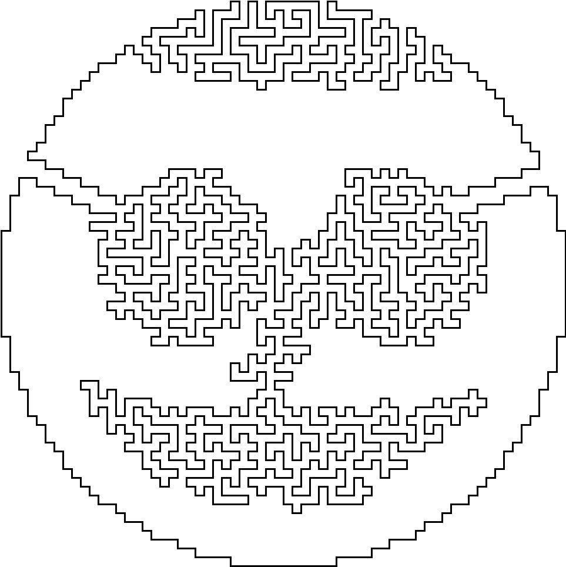

<h1 style='text-align: center;'> E. Jordan Smiley</h1>

<h5 style='text-align: center;'>time limit per test: 1 second</h5>
<h5 style='text-align: center;'>memory limit per test: 256 megabytes</h5>

  ## Input

The input contains two integers $row$, $col$ ($0 \le row, col \le 63$), separated by a single space.

## Output

## Output

 "IN" or "OUT".

## Examples

## Input


```

0 0

```
## Output


```

OUT

```
## Input


```

27 0

```
## Output


```

IN

```
## Input


```

0 27

```
## Output


```

OUT

```
## Input


```

27 27

```
## Output


```

IN

```


#### tags 

#*special #dfs_and_similar #geometry #implementation 