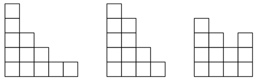
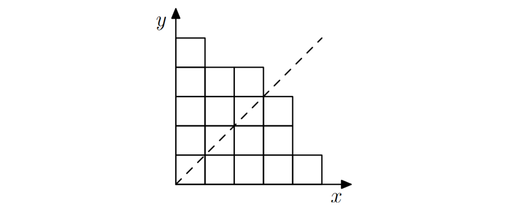

<h1 style='text-align: center;'> C. Симметричный амфитеатр</h1>

<h5 style='text-align: center;'>ограничение по времени на тест: 2 секунды</h5>
<h5 style='text-align: center;'>ограничение по памяти на тест: 512 мегабайт</h5>

Все готовятся к VK Fest 2021! Для того, чтобы зрителям была лучше видна главная сцена, планируется построить амфитеатр. В этой задаче мы будем рассматривать его сбоку — схематично он будет иметь форму лестницы из $n$ одинаковых квадратов. Лестница — это одна или более башен квадратов, выстроенных в ряд, где высоты башен невозрастают слева направо.

На следующем рисунке можно видеть три разные фигуры из $12$ квадратов. Первые две фигуры — лестницы, а третья — нет.

  Из эстетических соображений было решено, что амфитеатр должен быть симметричным. Формально, амфитеатр называется симметричным, если при отражении его схемы относительно прямой $x = y$ получается тот же самый рисунок (где ось $x$ направлена слева направо, а ось $y$ — снизу вверх). Например, первая лестница на рисунке выше — симметричная, а вторая — нет.

  Кроме того, амфитеатр должен быть максимально компактным — а именно, сторона минимального квадрата, внутрь которого можно его поместить, должна быть как можно меньше.

По заданному числу $n$ нарисуйте схему амфитеатра из ровно $n$ квадратов, удовлетворяющую всем условиям.

## Входные данные

В единственной строке задано одно целое число $n$ ($1 \le n \le 100$) — число квадратов, из которых нужно составить схему амфитеатра.

## Выходные данные

Если не существует схемы амфитеатра из $n$ квадратов, выведите единственное число $-1$.

Иначе в первой строке выведите целое число $m$ — минимальное возможное число строк и столбцов в схеме амфитеатра. Далее выведите $m$ строк, описывающих схему. Каждая строка должна содержать ровно $m$ символов 'o' (строчная латинская буква) или '.', где 'o' описывает построенный квадрат, а '.' — пустое место. Схема амфитеатра должна состоять ровно из $n$ символов 'o'. Ячейка в левом нижнем углу должна содержать квадрат. Если возможных ответов с минимальным $m$ несколько, выведите любой из них.

## Примеры

## Входные данные


```

3

```
## Выходные данные


```

2
o.
oo

```
## Входные данные


```

17

```
## Выходные данные


```

5
o....
ooo..
oooo.
oooo.
ooooo

```


#### tags 

#*special #constructive_algorithms #dp 