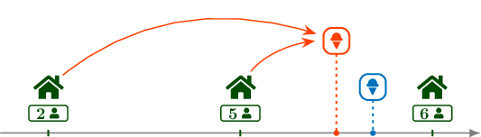
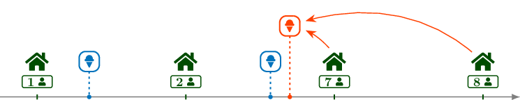

<h1 style='text-align: center;'> I. Ice Cream Shop</h1>

<h5 style='text-align: center;'>time limit per test: 2 seconds</h5>
<h5 style='text-align: center;'>memory limit per test: 256 megabytes</h5>

On a beach there are $n$ huts in a perfect line, hut $1$ being at the left and hut $i+1$ being $100$ meters to the right of hut $i$, for all $1 \le i \le n - 1$. In hut $i$ there are $p_i$ people.

There are $m$ ice cream sellers, also aligned in a perfect line with all the huts. The $i$-th ice cream seller has their shop $x_i$ meters to the right of the first hut. All ice cream shops are at distinct locations, but they may be at the same location as a hut.

You want to open a new ice cream shop and you wonder what the best location for your shop is. You can place your ice cream shop anywhere on the beach (not necessarily at an integer distance from the first hut) as long as it is aligned with the huts and the other ice cream shops, even if there is already another ice cream shop or a hut at that location. You know that people would come to your shop only if it is strictly closer to their hut than any other ice cream shop.

If every person living in the huts wants to buy exactly one ice cream, what is the maximum number of ice creams that you can sell if you place the shop optimally?

## Input

The first line contains two integers $n$ and $m$ ($2 \le n \le 200\,000$, $1 \le m \le 200\,000$) — the number of huts and the number of ice cream sellers.

The second line contains $n$ integers $p_1, p_2, \ldots, p_n$ ($1 \le p_i \le 10^9$) — the number of people in each hut.

The third line contains $m$ integers $x_1, x_2, \ldots, x_m$ ($0 \le x_i \le 10^9$, $x_i \ne x_j$ for $i \ne j$) — the location of each ice cream shop.

## Output

Print the maximum number of ice creams that can be sold by choosing optimally the location of the new shop.

## Examples

## Input


```

3 1
2 5 6
169

```
## Output


```

7

```
## Input


```

4 2
1 2 7 8
35 157

```
## Output


```

15

```
## Input


```

4 1
272203905 348354708 848256926 939404176
20

```
## Output


```

2136015810

```
## Input


```

3 2
1 1 1
300 99

```
## Output


```

2

```
## Note

In the first sample, you can place the shop (coloured orange in the picture below) $150$ meters to the right of the first hut (for example) so that it is the closest shop to the first two huts, which have $2$ and $5$ people, for a total of $7$ sold ice creams.

  In the second sample, you can place the shop $170$ meters to the right of the first hut (for example) so that it is the closest shop to the last two huts, which have $7$ and $8$ people, for a total of $15$ sold ice creams.

  

#### tags 

#brute_force #implementation #sortings 