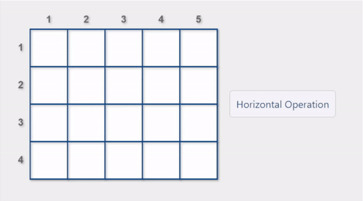

<h1 style='text-align: center;'> G. Grid Reset</h1>

<h5 style='text-align: center;'>time limit per test: 2 seconds</h5>
<h5 style='text-align: center;'>memory limit per test: 256 megabytes</h5>

You are given a grid consisting of $n$ rows and $m$ columns, where each cell is initially white. Additionally, you are given an integer $k$, where $1 \le k \le \min(n, m)$.

You will process $q$ operations of two types: 

* $\mathtt{H}$ (horizontal operation) — You choose a $1 \times k$ rectangle completely within the grid, where all cells in this rectangle are white. Then, all cells in this rectangle are changed to black.
* $\mathtt{V}$ (vertical operation) — You choose a $k \times 1$ rectangle completely within the grid, where all cells in this rectangle are white. Then, all cells in this rectangle are changed to black.

After each operation, if any rows or columns become completely black, all cells in these rows and columns are simultaneously reset to white. Specifically, if all cells in the row and column a cell is contained in become black, all cells in both the row and column will be reset to white.

Choose the rectangles in a way that you can perform all given operations, or determine that it is impossible.

## Input

Each test contains multiple test cases. The first line contains a single integer $t$ ($1 \le t \le 1000$) — the number of test cases. The description of test cases follows.

The first line of each test case contains four integers $n$, $m$, $k$, and $q$ ($1 \le n, m \le 100$, $1 \le k \le \min(n, m)$, $1 \le q \le 1000$) — the number of rows and columns in the grid, the size of the operation rectangle, and the number of operations, respectively.

The second line of each test case contains a string $s$ of length $q$, consisting only of characters $\mathtt{H}$ and $\mathtt{V}$ — the sequence of operation types.

It is guaranteed that the sum of $q$ over all test cases does not exceed $1000$.

## Output

For each test case, output a single integer $-1$ if it is impossible to perform all the operations.

Otherwise, output $q$ lines. Each line contains two integers $i$, $j$ ($1 \le i \le n$, $1 \le j \le m$) — the coordinates of the top-left cell of the operation rectangle.

If there are multiple solutions, output any of them.

## Example

## Input


```

14 5 3 6HVVHHV
```
## Output


```

1 1
2 1
1 1
2 3
3 3
2 2

```
## Note

  Illustration of example. The first operation is horizontal. The operation rectangle starts at $(1,1)$ and is a $1 \times 3$ rectangle. After the operation, cells $(1,1)$, $(1,2)$, and $(1,3)$ become black.

The second operation is vertical. The operation rectangle starts at $(2,1)$ and is a $3 \times 1$ rectangle. After the operation, cells $(2,1)$, $(3,1)$, and $(4,1)$ become black. At this point, the first column becomes completely black, so all cells in the first column are reset to white.

The third operation is vertical. The operation rectangle starts at $(1,1)$ and is a $3 \times 1$ rectangle. After the operation, cells $(1,1)$, $(2,1)$, and $(3,1)$ become black.

The fourth operation is horizontal. The operation rectangle starts at $(2,3)$ and is a $1 \times 3$ rectangle. After the operation, cells $(2,3)$, $(2,4)$, and $(2,5)$ become black.

The fifth operation is horizontal. The operation rectangle starts at $(3,3)$ and is a $1 \times 3$ rectangle. After the operation, cells $(3,3)$, $(3,4)$, and $(3,5)$ become black.

The sixth operation is vertical. The operation rectangle starts at $(2,2)$ and is a $3 \times 1$ rectangle. After the operation, cells $(2,2)$, $(3,2)$, and $(4,2)$ become black. At this point, two rows and one column become completely black, so all cells in these rows and the column are reset to white.


#### tags 

#constructive_algorithms #greedy #implementation 