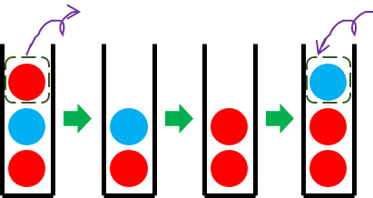
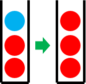

<h1 style='text-align: center;'> B. Red and Blue Balls</h1>

<h5 style='text-align: center;'>time limit per test: 0.5 seconds</h5>
<h5 style='text-align: center;'>memory limit per test: 256 megabytes</h5>

User ainta has a stack of *n* red and blue balls. He can apply a certain operation which changes the colors of the balls inside the stack.

* While the top ball inside the stack is red, pop the ball from the top of the stack.
* Then replace the blue ball on the top with a red ball.
* And finally push some blue balls to the stack until the stack has total of *n* balls inside.

  If there are no blue balls inside the stack, ainta can't apply this operation. Given the initial state of the stack, ainta wants to know the maximum number of operations he can repeatedly apply.

## Input

The first line contains an integer *n* (1 ≤ *n* ≤ 50) — the number of balls inside the stack.

The second line contains a string *s* (|*s*| = *n*) describing the initial state of the stack. The *i*-th character of the string *s* denotes the color of the *i*-th ball (we'll number the balls from top to bottom of the stack). If the character is "R", the color is red. If the character is "B", the color is blue.

## Output

Print the maximum number of operations ainta can repeatedly apply.

Please, do not write the %lld specifier to read or write 64-bit integers in С++. It is preferred to use the cin, cout streams or the %I64d specifier.

## Examples

## Input


```
3  
RBR  

```
## Output


```
2  

```
## Input


```
4  
RBBR  

```
## Output


```
6  

```
## Input


```
5  
RBBRR  

```
## Output


```
6  

```
## Note

The first example is depicted below.

The explanation how user ainta applies the first operation. He pops out one red ball, changes the color of the ball in the middle from blue to red, and pushes one blue ball.

  The explanation how user ainta applies the second operation. He will not pop out red balls, he simply changes the color of the ball on the top from blue to red.

  From now on, ainta can't apply any operation because there are no blue balls inside the stack. ainta applied two operations, so the answer is 2.

The second example is depicted below. The blue arrow denotes a single operation.

  

#### tags 

